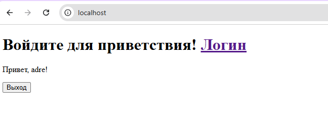
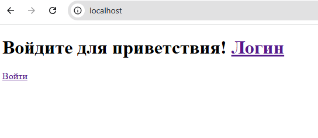

# Django Auth App с Docker

Простое Django-приложение с авторизацией (логин/логаут) в Docker-контейнере. Главная страница показывает статус авторизации.

```bash
git clone git@github.com:adresmoke/djangodocker.git
cd djangodocker
docker build -t django:prod .
sudo docker run -d --name djprod -p 80:8000 django:prod
```
Остановить и удалить контейнер:
```bash
sudo docker stop djprod
sudo docker rm djprod
```
login: adre
passwd: 123


